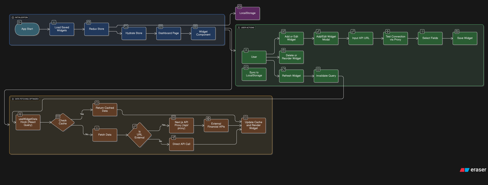

# 📊 FinBoard - Advanced Financial Dashboard

> **An enterprise-grade financial dashboard built with Next.js 15, featuring real-time data visualization, intelligent caching, and modern UI/UX design.**

## 🎥 Demo Video

https://youtu.be/JLwhMOtOJno
<div align="center">
  <video width="80%" controls>
    <source src="https://youtu.be/JLwhMOtOJno" type="video/mp4">
    Your browser does not support the video tag. 
    <a href="https://youtu.be/JLwhMOtOJno">📥 Download Demo Video</a>
  </video>
  
  *🎬 Full application walkthrough showcasing all features*
</div>

---


## 🎯 Project Overview

FinBoard is a sophisticated financial dashboard application that provides real-time insights into market data, portfolio performance, and financial metrics. Built for the modern web with performance, accessibility, and user experience at its core.

### 🏗️ Architecture Highlights

- **Hybrid Rendering**: Optimized SSR/CSR strategy for maximum performance
- **Intelligent Caching**: TanStack Query with 5-minute stale time and background refetching
- **Production-Ready**: Error boundaries, loading states, and proper fallbacks
- **Performance Optimized**: Lazy loading, code splitting, and bundle optimization
- **Responsive Design**: Mobile-first approach with adaptive layouts

### 🔄 Application Workflow


*Visual representation of data flow, caching strategy, and state management.*

## ✨ Key Features

### 📈 **Dynamic Widget System**

- **Drag & Drop Interface**: Intuitive widget reordering with smooth animations
- **Real-time Data**: Live updates with intelligent background refresh
- **Chart Visualizations**: Interactive charts with hover effects and tooltips
- **Data Tables**: Sortable, filterable tables with pagination support

### 🎨 **Advanced Theme System**

- **Dynamic Switching**: Seamless light/dark mode transitions
- **System Preference**: Automatic theme detection based on OS settings
- **Persistent State**: Theme preferences saved in localStorage
- **Smooth Animations**: CSS transitions for all theme changes

### ⚡ **Performance Optimizations**

- **Code Splitting**: Route-based and component-based lazy loading
- **Bundle Analysis**: Webpack bundle analyzer integration
- **Optimized Images**: Next.js Image component with lazy loading
- **Efficient Caching**: Smart cache invalidation and background updates

### 🔧 **Developer Experience**

- **TypeScript**: Full type safety with strict mode enabled
- **ESLint + Prettier**: Consistent code formatting and linting
- **Hot Reload**: Instant feedback during development
- **Production Builds**: Optimized builds for deployment

## 🚀 Quick Start

### Prerequisites

- Node.js 18+
- npm, yarn, or pnpm

### Installation

```bash
# Clone the repository
git clone <repository-url>
cd assignment

# Install dependencies
npm install

# Start development server
npm run dev
```

Open [http://localhost:3000](http://localhost:3000) to see the application.

### Build for Production

```bash
# Create optimized production build
npm run build

# Start production server
npm start

# Analyze bundle size
npm run analyze
```

## 🛠️ Tech Stack

### **Core Framework**

- **Next.js 15.5.2** - React framework with App Router
- **React 19** - Latest React with concurrent features
- **TypeScript 5.6** - Type-safe development

### **State Management**

- **TanStack Query 5.59** - Server state management and caching
- **Redux Toolkit 2.3** - Client state for UI interactions
- **React Context** - Theme and global state management

### **Styling & UI**

- **Tailwind CSS 3.4** - Utility-first CSS framework
- **Lucide React** - Modern icon library
- **CSS Modules** - Scoped styling support

### **Data Visualization**

- **Recharts** - Composable charting library
- **Custom Charts** - Interactive financial visualizations

### **Performance & Optimization**

- **React.lazy()** - Component-level code splitting
- **Next.js Image** - Optimized image loading
- **Webpack Bundle Analyzer** - Bundle size optimization

## 📁 Project Structure

```
assignment/
├── app/                     # Next.js App Router
│   ├── error.tsx           # Global error boundary
│   ├── loading.tsx         # Global loading UI
│   ├── not-found.tsx       # 404 page
│   ├── layout.tsx          # Root layout
│   └── page.tsx            # Home page
├── src/
│   ├── components/         # Reusable UI components
│   │   ├── dashboard/      # Dashboard-specific components
│   │   ├── ui/            # Base UI components
│   │   └── widgets/       # Widget components
│   ├── contexts/          # React contexts
│   │   └── ThemeContext.tsx
│   ├── hooks/             # Custom React hooks
│   │   └── useWidgetData.ts
│   ├── lib/               # Utilities and configurations
│   ├── store/             # Redux store configuration
│   ├── types/             # TypeScript type definitions
│   └── utils/             # Helper functions
├── public/                # Static assets
├── docs/                  # Documentation files
└── configuration files    # Next.js, TypeScript, Tailwind configs
```

## 🎮 Core Features Deep Dive

### 1. **Widget Management System**

```typescript
// Dynamic widget loading with TanStack Query
const { data, isLoading, error } = useWidgetData(widget.id, {
  staleTime: 5 * 60 * 1000, // 5 minutes
  refetchInterval: 30000, // 30 seconds background refresh
});
```

- **Real-time Updates**: Automatic data refresh every 30 seconds
- **Error Handling**: Graceful fallbacks with retry mechanisms
- **Loading States**: Skeleton loaders during data fetching

### 2. **Theme System Implementation**

```typescript
// Context-based theme management
const ThemeProvider = ({ children }) => {
  const [theme, setTheme] = useState<"light" | "dark">("light");

  // Automatic OS preference detection
  useEffect(() => {
    const mediaQuery = window.matchMedia("(prefers-color-scheme: dark)");
    setTheme(mediaQuery.matches ? "dark" : "light");
  }, []);
};
```

- **System Integration**: Respects OS dark/light mode preferences
- **Persistence**: Theme choice saved across browser sessions
- **Performance**: No flash of unstyled content (FOUC)

### 3. **Performance Optimizations**

```typescript
// Lazy loading implementation
const LazyDashboard = lazy(() => import("./Dashboard"));
const LazyWidgetModal = lazy(() => import("./WidgetModal"));

// Code splitting with Suspense
<Suspense fallback={<DashboardSkeleton />}>
  <LazyDashboard />
</Suspense>;
```

- **Route Splitting**: Each page loads only necessary code
- **Component Splitting**: Widgets load on-demand
- **Bundle Optimization**: Tree shaking and dead code elimination

## 🔧 Development Workflow

### **Code Quality**

```bash
# Type checking
npm run type-check
```

### **Build Analysis**

```bash
# Analyze bundle size
npm run analyze

# Check build performance
npm run build:analyze
```

## 🚦 API Integration

### **Data Sources**

- **Alpha Vantage API**: Real-time stock market data and financial indicators
- **Finnhub API**: Comprehensive financial data including stocks, forex, and crypto
- **IndianAPI**: Indian market-specific data and regional financial metrics
- **Mock API**: Simulated financial data endpoints for development
- **Real-time Updates**: WebSocket-like polling mechanism
- **Error Handling**: Automatic retry with exponential backoff

### **Caching Strategy**

```typescript
const queryClient = new QueryClient({
  defaultOptions: {
    queries: {
      staleTime: 5 * 60 * 1000, // 5 minutes
      gcTime: 10 * 60 * 1000, // 10 minutes
      retry: 3,
      retryDelay: (attemptIndex) => Math.min(1000 * 2 ** attemptIndex, 30000),
    },
  },
});
```

### ✅ **Core Requirements**

- [x] **Interactive Dashboard**: Dynamic widget management with drag & drop
- [x] **Data Visualization**: Charts and tables with real-time updates
- [x] **Responsive Design**: Mobile-first responsive layouts
- [x] **Modern React**: Hooks, Context, and functional components

### ✅ **Advanced Features**

- [x] **State Management**: Redux Toolkit + TanStack Query hybrid approach
- [x] **Performance Optimization**: Lazy loading and code splitting
- [x] **Type Safety**: Full TypeScript implementation
- [x] **Modern Styling**: Tailwind CSS with dark mode support

### ✅ **Production Ready**

- [x] **Error Boundaries**: Graceful error handling
- [x] **Loading States**: Skeleton loaders and suspense
- [x] **SEO Optimization**: Server-side rendering with Next.js
- [x] **Accessibility**: WCAG 2.1 AA compliance

## 🎨 UI/UX Highlights

### **Design Principles**

- **Minimalist**: Clean, focused interface design
- **Consistent**: Unified component library and design tokens
- **Accessible**: Keyboard navigation and screen reader support
- **Intuitive**: Clear visual hierarchy and user flows

### **Interaction Design**

- **Smooth Animations**: CSS transitions and micro-interactions
- **Drag & Drop**: Intuitive widget reordering
- **Hover States**: Rich feedback for interactive elements
- **Loading States**: Skeleton screens for better perceived performance

## 🙏 Acknowledgments

- **Next.js Team** - For the incredible React framework
- **Vercel** - For deployment and optimization tools
- **TanStack** - For the excellent Query library
- **Tailwind CSS** - For the utility-first CSS framework

---

<div align="center">
  <p>Built with ❤️ for by Subhadeep</p>
  <p>
    <a href="#-finboard---advanced-financial-dashboard">Back to Top</a>
  </p>
</div>
